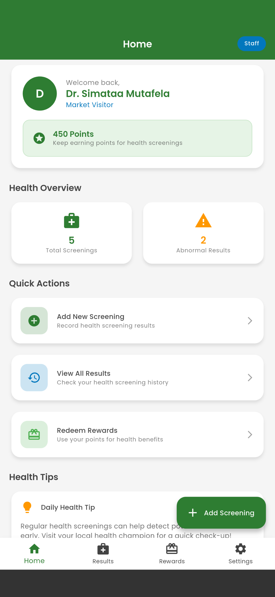

# BwinoLink YouthCare; App Prototype

A comprehensive Flutter-based mobile application that connects health screenings to private phone follow-up, designed to improve health outcomes in market communities.

## App Overview

BwinoLink is a mobile health application that bridges the gap between public health screenings at convenient locations and personalized follow-up care. The app serves two main user types:

<p align="center">
  
</p>

- **Users**: Can view their health screening results, track their health progress, and redeem rewards
- **Health Staff**: Healthcare workers who conduct screenings and record results in the app


## Key Features

### Authentication & User Management
- Password-based login system
- Role-based access control (User/Peer Navigator/Staff)
- User profile management

### Home Dashboard
- Personalized welcome screen with user information
- Health statistics overview (total screenings, abnormal results)
- Quick action buttons for common tasks
- Points system display

### Health Results Management
- Comprehensive screening results display
- Filtering by test type, status, and date
- Detailed result information with notes
- Abnormal result highlighting

### Rewards System
- Points-based reward redemption
- Health-focused rewards (checkups, supplements, consultations)
- Progress tracking towards reward goals

### Settings & Configuration
- User profile management
- Role switching functionality
- App settings and preferences
- Logout functionality

### Screening Management (Staff Only)
- Add new health screenings
- Multiple test types support:
  - Blood Pressure
  - Blood Sugar
  - BMI
  - Cholesterol
  - Vision Test
  - Hearing Test
  - HIV Test
- Patient information management
- Result status tracking (Normal/Abnormal/Pending)

## Technical Architecture

### Frontend Framework
- **Flutter**: Cross-platform mobile development
- **Material Design 3**: Modern, accessible UI components
- **Provider**: State management solution

### App Structure
```
lib/
├── main.dart                 # App entry point
├── providers/
│   └── app_state.dart       # Global state management
├── screens/
│   ├── login_screen.dart    # Authentication screen
│   ├── home_screen.dart     # Main navigation container
│   ├── home_tab.dart        # Home dashboard
│   ├── results_tab.dart     # Health results display
│   ├── rewards_tab.dart     # Rewards management
│   ├── settings_tab.dart    # User settings
│   └── add_screening_screen.dart # New screening form
├── widgets/
│   └── screening_result_card.dart # Reusable result card
├── theme/
│   └── app_theme.dart       # App styling and theming
└── data/
    └── dummy_data.dart      # Sample data for demonstration
```

### State Management
- **Provider Pattern**: Centralized state management
- **User Authentication**: Login/logout state
- **Role-based Access**: Different features for different user types
- **Data Persistence**: Local data management (ready for backend integration)

## Design Features

### Color Scheme
- **Primary Green**: Health and wellness focus
- **Secondary Blue**: Trust and professionalism
- **Accent Colors**: Supporting color palette
- **Accessibility**: High contrast ratios for readability

### Typography
- **Poppins Font**: Modern, clean, and highly readable
- **Hierarchical Text**: Clear information hierarchy
- **Responsive Design**: Adapts to different screen sizes

### UI Components
- **Material Design 3**: Latest design standards
- **Card-based Layout**: Clean, organized information display
- **Interactive Elements**: Touch-friendly buttons and forms
- **Status Indicators**: Clear visual feedback for health status

## Getting Started

### Prerequisites
- Flutter SDK (3.6.1 or higher)
- Dart SDK
- Android Studio / VS Code
- Android Emulator or physical device

### Installation
1. Clone the repository
2. Navigate to the project directory
3. Run `flutter pub get` to install dependencies
4. Run `flutter run` to start the app

### Dependencies
```yaml
dependencies:
  flutter:
    sdk: flutter
  provider: ^6.1.1
  google_fonts: ^6.1.0
  cupertino_icons: ^1.0.8
```

## App Flow

### For Users
1. **Login**: Enter phone number to access personal health data
2. **View Results**: Check health screening results and history
3. **Track Progress**: Monitor health improvements over time
4. **Earn Points**: Participate in screenings to earn points
5. **Redeem Rewards**: Use points for health-related benefits

### For Health Staff
1. **Login**: Access staff features with elevated permissions
2. **Conduct Screenings**: Record new health screening results
3. **Manage Data**: View and update screening information
4. **Track Impact**: Monitor community health improvements
5. **Support Follow-up**: Ensure proper care coordination

## Future Enhancements

### Backend Integration
- **API Integration**: Connect to health information systems
- **Data Synchronization**: Real-time data updates
- **User Authentication**: Secure backend authentication
- **Data Analytics**: Health trend analysis and reporting

### Advanced Features
- **Push Notifications**: Health reminders and updates
- **Telemedicine Integration**: Video consultation capabilities
- **Health Education**: Educational content and resources
- **Community Features**: Peer support and sharing

### Analytics & Reporting
- **Health Metrics**: Population health analytics
- **Trend Analysis**: Long-term health pattern recognition
- **Reporting Tools**: Healthcare provider reports
- **Data Export**: Secure data sharing capabilities

## Testing

The app includes comprehensive testing:
- **Unit Tests**: Core functionality validation
- **Widget Tests**: UI component testing
- **Integration Tests**: End-to-end workflow testing

Run tests with: `flutter test`

## License

This project is developed as a prototype for demonstration purposes.

## Contributing

This is a prototype application. For production use, additional security, testing, and compliance measures would be required.

## Support

For questions or support regarding this prototype, please refer to the project documentation or contact the development team.

---

**BwinoLink YouthCare** - Connecting Health, Empowering Communities
